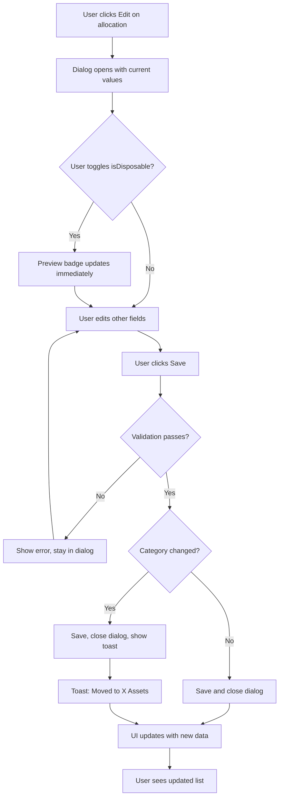

# UI/UX Design Document: Disposable Toggle Behavior Fix

**Design Date**: 2026-02-07
**Target Platform**: Web (Desktop + Mobile Responsive)
**Related Files**:
- `/workspaces/InvestmentTracker/frontend/src/features/total-assets/components/DisposableAssetsSection.tsx`
- `/workspaces/InvestmentTracker/frontend/src/features/total-assets/components/NonDisposableAssetsSection.tsx`
- `/workspaces/InvestmentTracker/frontend/src/features/fund-allocations/components/AllocationFormDialog.tsx`
- `/workspaces/InvestmentTracker/frontend/src/features/total-assets/pages/TotalAssetsDashboard.tsx`

---

## 1. Problem Analysis

### 1.1 Current Behavior

The current implementation has the following issues:

1. **Jarring Item Movement**: When a user toggles `isDisposable` in `AllocationFormDialog`, after saving, items immediately jump between `DisposableAssetsSection` and `NonDisposableAssetsSection`. This causes:
   - Visual disorientation (user loses track of the item)
   - No visual feedback about where the item moved
   - Confusion about what happened

2. **Inconsistent Section Heights**: The two sections (`DisposableAssetsSection` with `lg:col-span-2` and `NonDisposableAssetsSection` with `lg:col-span-1`) have dynamic heights that change based on content, causing layout shifts.

3. **Lack of Transition Feedback**: There is no animation or visual cue when an item changes categories.

### 1.2 User Pain Points

- Users cannot predict where their edited item will appear after saving
- The sudden layout shift is disorienting
- No confirmation or preview of the category change
- Hard to verify the change was successful

---

## 2. Design Goals

### 2.1 User Goals
- Easily understand where an allocation belongs (disposable vs non-disposable)
- Clearly see the effect of toggling the disposable status before committing
- Maintain context when editing allocations

### 2.2 Business Goals
- Reduce user confusion and support tickets
- Improve data accuracy by making the toggle consequence clear
- Maintain a polished, professional UI experience

---

## 3. Solution Options Analysis

### Option A: Keep Items in Place During Edit (Recommended)

**Concept**: Items stay in their original section while the dialog is open. After the dialog closes successfully, apply a smooth transition animation to move the item.

**Pros**:
- Minimal code change
- User maintains context
- Clear visual feedback with animation

**Cons**:
- Requires animation implementation
- Brief delay between save and visual update

### Option B: Confirmation Dialog for Category Change

**Concept**: When user toggles `isDisposable` and submits, show a confirmation dialog: "This will move the allocation to [Non-Disposable/Disposable] assets. Continue?"

**Pros**:
- Explicit user consent
- Clear communication of consequence

**Cons**:
- Extra click for users
- May feel cumbersome for frequent edits

### Option C: Unified List with Visual Indicators

**Concept**: Replace the two separate sections with a single unified "Fund Allocations" list. Use badges/tags to indicate disposable status.

**Pros**:
- No item jumping between sections
- Simpler mental model
- More scalable for future categories

**Cons**:
- Significant UI redesign
- May lose the clear visual separation of asset types
- Larger refactoring effort

### Option D: Preview Mode in Dialog

**Concept**: Show a live preview in the dialog of which section the item will appear in based on the checkbox state.

**Pros**:
- Immediate feedback while editing
- User can see consequence before saving

**Cons**:
- Adds complexity to dialog
- May clutter the form

---

## 4. Recommended Solution: Option A + D Hybrid

Combine "Keep Items in Place During Edit" with "Preview Mode in Dialog" for the best user experience with minimal disruption.

### 4.1 Key Features

1. **Category Preview Badge in Dialog**: Show a dynamic badge in the dialog that updates as the user toggles the checkbox, clearly indicating where the allocation will be placed.

2. **Smooth Exit Animation**: When an item moves to a different section after save, animate it out of the current section before the list updates.

3. **Success Toast with Location**: Show a toast message indicating where the allocation was saved: "Allocation saved to [Disposable/Non-Disposable] assets"

4. **Consistent Section Heights**: Apply `min-height` to both sections to prevent layout shift.

---

## 5. Page Structure Design

### 5.1 Current Layout (No Change to Structure)

```
+------------------------------------------------------------------+
|  Total Assets Dashboard Header                                    |
+------------------------------------------------------------------+
|                                                                  |
|  +--------------------+  +--------------------+                  |
|  |  Core Metrics      |  |  Core Metrics      |                  |
|  +--------------------+  +--------------------+                  |
|                                                                  |
|  +-------------------------------------------------------------+ |
|  |  Assets Breakdown Pie Chart (Full Width)                    | |
|  +-------------------------------------------------------------+ |
|                                                                  |
|  +-----------------------------------+  +----------------------+ |
|  |  Disposable Assets Section        |  | Non-Disposable       | |
|  |  (lg:col-span-2)                  |  | Assets Section       | |
|  |                                   |  | (lg:col-span-1)      | |
|  |  min-h-[280px]  <-- NEW           |  | min-h-[280px] <--NEW | |
|  +-----------------------------------+  +----------------------+ |
|                                                                  |
|  +-------------------------------------------------------------+ |
|  |  Fund Allocation Management (AllocationSummary)             | |
|  |  [Edit] opens AllocationFormDialog                          | |
|  +-------------------------------------------------------------+ |
|                                                                  |
+------------------------------------------------------------------+
```

### 5.2 Section Height Consistency Fix

Both sections should have a minimum height to prevent layout jumps:

```
DisposableAssetsSection:    min-h-[280px]
NonDisposableAssetsSection: min-h-[280px]
```

---

## 6. Component Design Changes

### 6.1 AllocationFormDialog Enhancement

#### New UI Element: Category Preview Badge

Add a preview badge below the checkbox that dynamically shows which category the allocation will belong to:

```
+----------------------------------------------------------+
|  Edit Allocation                                    [X]  |
+----------------------------------------------------------+
|                                                          |
|  Purpose:  [EmergencyFund       v]                       |
|                                                          |
|  +------------------------------------------------------+|
|  |  Disposable Funds                                    ||
|  |  Check to count as disposable deposit                ||
|  |                                                      ||
|  |  [x] Disposable    <-- Current Toggle                ||
|  |                                                      ||
|  |  +------------------------------------------------+  ||
|  |  |  CATEGORY PREVIEW (NEW)                        |  ||
|  |  |  +---------+                                   |  ||
|  |  |  | Will be saved to:                          |  ||
|  |  |  | +-------------------------------------+    |  ||
|  |  |  | | [Disposable Assets]  (peach badge)  |    |  ||
|  |  |  | +-------------------------------------+    |  ||
|  |  |  +---------+                                   |  ||
|  |  +------------------------------------------------+  ||
|  +------------------------------------------------------+|
|                                                          |
|  Amount (TWD):  [100000     ]                            |
|                                                          |
|  Note:  [Emergency backup fund        ]                  |
|                                                          |
+----------------------------------------------------------+
|                          [Cancel]  [Save Allocation]     |
+----------------------------------------------------------+
```

#### Props Interface Update

```typescript
// No changes to existing props interface
// The preview is purely UI state based on existing isDisposable state
```

#### State-Driven Preview Display

```tsx
// Inside AllocationFormDialog component

// Dynamic preview text and styling
const categoryPreview = isDisposable
  ? { label: 'Disposable Assets', className: 'bg-[var(--accent-peach)]/20 text-[var(--accent-peach)]' }
  : { label: 'Non-Disposable Assets', className: 'bg-[var(--text-muted)]/20 text-[var(--text-muted)]' };
```

#### Transition Animation on Category Change

When user is in edit mode and the saved `isDisposable` differs from the original value, show a subtle "moving" animation:

```tsx
// Add to handleFormSubmit success path
const categoryChanged = editingAllocation && editingAllocation.isDisposable !== data.isDisposable;
if (categoryChanged) {
  // Toast with category change notification
  showToast(`Allocation moved to ${data.isDisposable ? 'Disposable' : 'Non-Disposable'} Assets`);
}
```

### 6.2 DisposableAssetsSection Changes

#### Add Minimum Height

```tsx
// Current:
<section className="card-dark p-6 space-y-5 lg:col-span-2">

// Updated:
<section className="card-dark p-6 space-y-5 lg:col-span-2 min-h-[280px]">
```

### 6.3 NonDisposableAssetsSection Changes

#### Add Minimum Height

```tsx
// Current:
<section className="card-dark p-6 space-y-5 lg:col-span-1">

// Updated:
<section className="card-dark p-6 space-y-5 lg:col-span-1 min-h-[280px]">
```

---

## 7. Interaction Flow Design

### 7.1 Edit Allocation Flow (Updated)



### 7.2 State Transitions

| Current State | Trigger | Next State | UI Change |
|---------------|---------|------------|-----------|
| Dialog Closed | Click Edit | Dialog Open | Show form with current values |
| Dialog Open | Toggle checkbox | Preview Updated | Badge shows new category |
| Dialog Open | Click Save | Validating | Button shows "Saving..." |
| Validating | Success | Dialog Closed | List refreshes, toast if category changed |
| Validating | Error | Error Shown | Error message in dialog |

---

## 8. Responsive Design

### 8.1 Breakpoint Behavior

| Screen Size | Section Layout | Min Height |
|-------------|----------------|------------|
| Mobile (<1024px) | Stacked (full width each) | min-h-[200px] |
| Desktop (>=1024px) | Side-by-side (2:1 ratio) | min-h-[280px] |

### 8.2 Responsive Tailwind Classes

```html
<!-- DisposableAssetsSection -->
<section class="
  card-dark p-6 space-y-5
  lg:col-span-2
  min-h-[200px] lg:min-h-[280px]
">

<!-- NonDisposableAssetsSection -->
<section class="
  card-dark p-6 space-y-5
  lg:col-span-1
  min-h-[200px] lg:min-h-[280px]
">
```

---

## 9. Visual Design Specifications

### 9.1 Category Preview Badge Styles

```css
/* Disposable (Active) */
.badge-disposable {
  background-color: rgba(var(--accent-peach-rgb), 0.2);
  color: var(--accent-peach);
  padding: 0.25rem 0.75rem;
  border-radius: 9999px;
  font-size: 0.75rem;
  font-weight: 500;
}

/* Non-Disposable */
.badge-non-disposable {
  background-color: rgba(var(--text-muted-rgb), 0.2);
  color: var(--text-muted);
  padding: 0.25rem 0.75rem;
  border-radius: 9999px;
  font-size: 0.75rem;
  font-weight: 500;
}
```

### 9.2 Tailwind Implementation

```tsx
// Category Preview in Dialog
<div className="mt-3 pt-3 border-t border-[var(--border-color)]">
  <p className="text-xs text-[var(--text-muted)] mb-2">
    Will be saved to:
  </p>
  <span className={`
    inline-block px-3 py-1 rounded-full text-xs font-medium
    transition-all duration-200
    ${isDisposable
      ? 'bg-[var(--accent-peach)]/20 text-[var(--accent-peach)]'
      : 'bg-[var(--text-muted)]/20 text-[var(--text-muted)]'
    }
  `}>
    {isDisposable ? 'Disposable Assets' : 'Non-Disposable Assets'}
  </span>
</div>
```

### 9.3 Toast Notification Style

```tsx
// Success toast for category change
<Toast variant="success">
  Allocation moved to {isDisposable ? 'Disposable' : 'Non-Disposable'} Assets
</Toast>
```

---

## 10. Accessibility (A11y)

### 10.1 Key Practices

| Practice | Implementation |
|----------|----------------|
| Preview Badge | Use `aria-live="polite"` to announce category changes |
| Checkbox Label | Clear `aria-label` describing the toggle effect |
| Focus Management | Return focus to edit button after dialog closes |
| Screen Reader | Announce "Category changed to X" on toggle |

### 10.2 ARIA Implementation

```tsx
// Category Preview with live region
<div
  className="mt-3 pt-3 border-t border-[var(--border-color)]"
  aria-live="polite"
  aria-atomic="true"
>
  <p className="text-xs text-[var(--text-muted)] mb-2" id="category-label">
    Will be saved to:
  </p>
  <span
    className="..."
    aria-labelledby="category-label"
  >
    {isDisposable ? 'Disposable Assets' : 'Non-Disposable Assets'}
  </span>
</div>

// Checkbox with descriptive label
<label className="inline-flex items-center gap-2 ...">
  <input
    type="checkbox"
    checked={isDisposable}
    onChange={(e) => setIsDisposable(e.target.checked)}
    aria-describedby="disposable-help"
    className="checkbox-dark"
  />
  <span>{isDisposable ? 'Disposable' : 'Non-Disposable'}</span>
</label>
<p id="disposable-help" className="sr-only">
  Checking this box will categorize this allocation as disposable funds
</p>
```

---

## 11. Implementation Checklist

### 11.1 File Changes Required

| File | Changes |
|------|---------|
| `AllocationFormDialog.tsx` | Add category preview badge with `aria-live` |
| `DisposableAssetsSection.tsx` | Add `min-h-[200px] lg:min-h-[280px]` |
| `NonDisposableAssetsSection.tsx` | Add `min-h-[200px] lg:min-h-[280px]` |
| `TotalAssetsDashboard.tsx` | Add toast notification for category changes |

### 11.2 Component Tree (Updated)

```
TotalAssetsDashboard
├── Header Card
├── CoreMetricsSection
├── AssetsBreakdownPieChart
├── Grid Container
│   ├── DisposableAssetsSection      <-- Add min-height
│   └── NonDisposableAssetsSection   <-- Add min-height
├── AllocationSummary
│   └── Edit Button → opens dialog
└── AllocationFormDialog             <-- Add preview badge
    ├── Purpose Select
    ├── Disposable Toggle
    │   └── CategoryPreviewBadge     <-- NEW
    ├── Amount Input
    ├── Note Textarea
    └── Action Buttons
```

---

## 12. Summary of Deliverables

### For Issue 1: Jarring Jump Effect

1. **Add Category Preview Badge** in `AllocationFormDialog` that updates dynamically when the checkbox is toggled
2. **Add Toast Notification** in `TotalAssetsDashboard` that appears after save when category changed
3. **Implement `aria-live`** region for screen reader announcements

### For Issue 2: Inconsistent Section Heights

1. **Add `min-h-[200px] lg:min-h-[280px]`** to `DisposableAssetsSection`
2. **Add `min-h-[200px] lg:min-h-[280px]`** to `NonDisposableAssetsSection`

---

## 13. Code Snippets for Implementation

### 13.1 AllocationFormDialog - Add Preview Badge

```tsx
// Add after the checkbox container (line 177 in current file)

{/* Category Preview Badge */}
<div
  className="mt-3 pt-3 border-t border-[var(--border-color)]"
  aria-live="polite"
  aria-atomic="true"
>
  <p className="text-xs text-[var(--text-muted)] mb-2">
    Will be saved to:
  </p>
  <span className={`
    inline-block px-3 py-1 rounded-full text-xs font-medium
    transition-all duration-200
    ${isDisposable
      ? 'bg-[var(--accent-peach)]/20 text-[var(--accent-peach)]'
      : 'bg-[var(--text-muted)]/20 text-[var(--text-muted)]'
    }
  `}>
    {isDisposable ? 'Disposable Assets' : 'Non-Disposable Assets'}
  </span>
</div>
```

### 13.2 DisposableAssetsSection - Add Min Height

```tsx
// Update line 18
<section className="card-dark p-6 space-y-5 lg:col-span-2 min-h-[200px] lg:min-h-[280px]">
```

### 13.3 NonDisposableAssetsSection - Add Min Height

```tsx
// Update line 16
<section className="card-dark p-6 space-y-5 lg:col-span-1 min-h-[200px] lg:min-h-[280px]">
```

### 13.4 TotalAssetsDashboard - Add Toast for Category Change

```tsx
// Import useToast hook (assuming it exists)
import { useToast } from '../../../components/common';

// Inside component
const { showToast } = useToast();

// Update handleFormSubmit
const handleFormSubmit = async (data: {
  purpose: AllocationPurpose;
  amount: number;
  isDisposable: boolean;
  note?: string;
}) => {
  const categoryChanged = editingAllocation && editingAllocation.isDisposable !== data.isDisposable;

  if (editingAllocation) {
    await updateAllocation(editingAllocation.id, {
      purpose: data.purpose,
      amount: data.amount,
      isDisposable: data.isDisposable,
      note: data.note,
    });

    if (categoryChanged) {
      showToast({
        type: 'success',
        message: `Allocation moved to ${data.isDisposable ? 'Disposable' : 'Non-Disposable'} Assets`,
      });
    }
  } else {
    await createAllocation({
      purpose: data.purpose,
      amount: data.amount,
      isDisposable: data.isDisposable,
      note: data.note,
    });
  }

  setIsFormOpen(false);
  setEditingAllocation(null);
};
```

---

## 14. Testing Scenarios

| Scenario | Expected Behavior |
|----------|-------------------|
| Toggle checkbox in dialog | Preview badge updates immediately |
| Save without category change | No toast, list updates normally |
| Save with category change | Toast appears, item moves to new section |
| Empty section after move | Section maintains min-height, shows empty state |
| Screen reader on toggle | Announces new category |
| Mobile layout | Sections stack with consistent min-height |

---

**End of Design Document**
